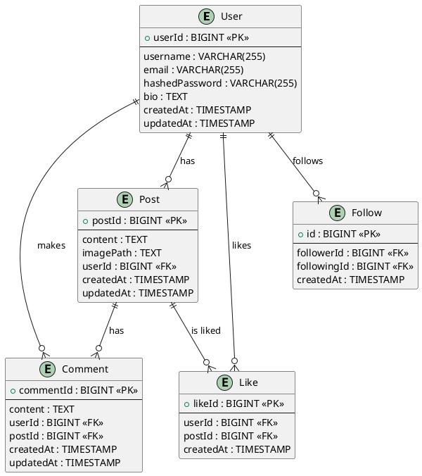

# Quackstagram Project Documentation

## Group Members

- David Henry Francis WIcker
- Raman Yousefi

## Java Entities

### Libraries Used

- `javax.persistence.*`: For ORM annotations and entity management.
- `java.time.LocalDateTime`: For timestamp management.

### User Entity

```java
import javax.persistence.*;
import java.time.LocalDateTime;
import java.util.Set;

@Entity
public class User {
    @Id
    @GeneratedValue(strategy = GenerationType.IDENTITY)
    private Long userId;

    @Column(nullable = false, unique = true)
    private String username;

    @Column(nullable = false, unique = true)
    private String email;

    @Column(nullable = false)
    private String hashedPassword;

    @Column(nullable = true)
    private String bio;

    @Column(nullable = false)
    private LocalDateTime createdAt;

    @Column(nullable = false)
    private LocalDateTime updatedAt;

    @OneToMany(mappedBy = "user", cascade = CascadeType.ALL, fetch = FetchType.LAZY)
    private Set<Post> posts;

    @OneToMany(mappedBy = "user", cascade = CascadeType.ALL, fetch = FetchType.LAZY)
    private Set<Comment> comments;

    @OneToMany(mappedBy = "user", cascade = CascadeType.ALL, fetch = FetchType.LAZY)
    private Set<Like> likes;

    @ManyToMany
    @JoinTable(
      name = "follows",
      joinColumns = @JoinColumn(name = "follower_id"),
      inverseJoinColumns = @JoinColumn(name = "following_id")
    )
    private Set<User> following;

    @ManyToMany(mappedBy = "following")
    private Set<User> followers;

    @PrePersist
    protected void onCreate() {
        createdAt = LocalDateTime.now();
        updatedAt = LocalDateTime.now();
    }

    @PreUpdate
    protected void onUpdate() {
        updatedAt = LocalDateTime.now();
    }

    // Getters and Setters
}
```

### Post Entity

```java
import javax.persistence.*;
import java.time.LocalDateTime;
import java.util.Set;

@Entity
public class Post {
    @Id
    @GeneratedValue(strategy = GenerationType.IDENTITY)
    private Long postId;

    @Column(nullable = false)
    private String content;

    @Column(nullable = false)
    private String imagePath;

    @Column(nullable = false)
    private LocalDateTime createdAt;

    @Column(nullable = false)
    private LocalDateTime updatedAt;

    @ManyToOne(fetch = FetchType.LAZY)
    @JoinColumn(name = "user_id", nullable = false)
    private User user;

    @OneToMany(mappedBy = "post", cascade = CascadeType.ALL, fetch = FetchType.LAZY)
    private Set<Comment> comments;

    @OneToMany(mappedBy = "post", cascade = CascadeType.ALL, fetch = FetchType.LAZY)
    private Set<Like> likes;

    @PrePersist
    protected void onCreate() {
        createdAt = LocalDateTime.now();
        updatedAt = LocalDateTime.now();
    }

    @PreUpdate
    protected void onUpdate() {
        updatedAt = LocalDateTime.now();
    }

    // Getters and Setters
}
```

### Comment Entity

```java
import javax.persistence.*;
import java.time.LocalDateTime;

@Entity
public class Comment {
    @Id
    @GeneratedValue(strategy = GenerationType.IDENTITY)
    private Long commentId;

    @Column(nullable = false)
    private String content;

    @Column(nullable = false)
    private LocalDateTime createdAt;

    @Column(nullable = false)
    private LocalDateTime updatedAt;

    @ManyToOne(fetch = FetchType.LAZY)
    @JoinColumn(name = "user_id", nullable = false)
    private User user;

    @ManyToOne(fetch = FetchType.LAZY)
    @JoinColumn(name = "post_id", nullable = false)
    private Post post;

    @PrePersist
    protected void onCreate() {
        createdAt = LocalDateTime.now();
        updatedAt = LocalDateTime.now();
    }

    @PreUpdate
    protected void onUpdate() {
        updatedAt = LocalDateTime.now();
    }

    // Getters and Setters
}
```

### Like Entity

```java
import javax.persistence.*;
import java.time.LocalDateTime;

@Entity
public class Like {
    @Id
    @GeneratedValue(strategy = GenerationType.IDENTITY)
    private Long likeId;

    @Column(nullable = false)
    private LocalDateTime createdAt;

    @ManyToOne(fetch = FetchType.LAZY)
    @JoinColumn(name = "user_id", nullable = false)
    private User user;

    @ManyToOne(fetch = FetchType.LAZY)
    @JoinColumn(name = "post_id", nullable = false)
    private Post post;

    @PrePersist
    protected void onCreate() {
        createdAt = LocalDateTime.now();
    }

    // Getters and Setters
}
```

### Follow Entity

```java
import javax.persistence.*;
import java.time.LocalDateTime;

@Entity
public class Follow {
    @Id
    @GeneratedValue(strategy = GenerationType.IDENTITY)
    private Long id;

    @Column(nullable = false)
    private LocalDateTime createdAt;

    @ManyToOne
    @JoinColumn(name = "follower_id", nullable = false)
    private User follower;

    @ManyToOne
    @JoinColumn(name = "following_id", nullable = false)
    private User following;

    @PrePersist
    protected void onCreate() {
        createdAt = LocalDateTime.now();
    }

    // Getters and Setters
}
```

## MySQL Schema

```sql
-- Create User table
CREATE TABLE User (
    userId BIGINT AUTO_INCREMENT PRIMARY KEY,
    username VARCHAR(255) NOT NULL UNIQUE,
    email VARCHAR(255) NOT NULL UNIQUE,
    hashedPassword VARCHAR(255) NOT NULL,
    bio TEXT,
    createdAt TIMESTAMP DEFAULT CURRENT_TIMESTAMP,
    updatedAt TIMESTAMP DEFAULT CURRENT_TIMESTAMP ON UPDATE CURRENT_TIMESTAMP
);

-- Create Post table
CREATE TABLE Post (
    postId BIGINT AUTO_INCREMENT PRIMARY KEY,
    content TEXT NOT NULL,
    imagePath TEXT NOT NULL,
    userId BIGINT NOT NULL,
    createdAt TIMESTAMP DEFAULT CURRENT_TIMESTAMP,
    updatedAt TIMESTAMP DEFAULT CURRENT_TIMESTAMP ON UPDATE CURRENT_TIMESTAMP,
    FOREIGN KEY (userId) REFERENCES User(userId)
);

-- Create Comment table
CREATE TABLE Comment (
    commentId BIGINT AUTO_INCREMENT PRIMARY KEY,
    content TEXT NOT NULL,
    userId BIGINT NOT NULL,
    postId BIGINT NOT NULL,
    createdAt TIMESTAMP DEFAULT CURRENT_TIMESTAMP,
    updatedAt TIMESTAMP DEFAULT CURRENT_TIMESTAMP ON UPDATE CURRENT_TIMESTAMP,
    FOREIGN KEY (userId) REFERENCES User(userId),
    FOREIGN KEY (postId) REFERENCES Post(postId)
);

-- Create Like table
CREATE TABLE `Like` (
    likeId BIGINT AUTO_INCREMENT PRIMARY KEY,
    userId BIGINT NOT NULL,
    postId BIGINT NOT NULL,
    createdAt TIMESTAMP DEFAULT CURRENT_TIMESTAMP,
    FOREIGN KEY (userId) REFERENCES User(userId),
    FOREIGN KEY (postId) REFERENCES Post(postId)
);

-- Create Follow table
CREATE TABLE Follow (
    id BIGINT AUTO_INCREMENT PRIMARY KEY,
    followerId BIGINT NOT NULL,
    followingId BIGINT NOT NULL,
    createdAt TIMESTAMP DEFAULT CURRENT_TIMESTAMP,
    FOREIGN KEY (followerId) REFERENCES User(userId),
    FOREIGN KEY (followingId) REFERENCES User(userId)
);
```

## Proof of 3NF

### User Table

1. **First Normal Form (1NF):** The table is in 1NF since all values are atomic and there are no repeating groups.
2. **Second Normal Form (2NF):** The table is in 2NF since there are no partial dependencies (all non-key attributes are fully dependent on the primary key).
3. **Third Normal Form (3NF):** The table is in 3NF since there are no transitive dependencies (all non-key attributes are directly dependent on the primary key).

### Post Table

1. **First Normal Form (1NF):** The table is in 1NF since all values are atomic and there are no repeating groups.
2. **Second Normal Form (2NF):** The table is in 2NF since there are no partial dependencies (all non-key attributes are fully dependent on the primary key).
3. **Third Normal Form (3NF):** The table is in 3NF since there are no transitive dependencies (all non-key attributes are directly dependent on the primary key).

### Comment Table

1. **First Normal Form (1NF):** The table is in 1NF since all values are atomic and there are no repeating groups.
2. **Second Normal Form (2NF):** The table is in 2NF since there are no partial dependencies (all non-key attributes are fully dependent on the primary key).
3. **Third Normal Form (3NF):** The table is in 3NF since there are no transitive dependencies (all non-key attributes are directly dependent on the primary key).

### Like Table

1. **First Normal Form (1NF):** The table is in 1NF since all values are atomic and there are no repeating groups.
2. **Second Normal Form (2NF):** The table is in 2NF since there are no partial dependencies (all non-key attributes are fully dependent on the primary key).
3. **Third Normal Form (3NF):** The table is in 3NF since there are

no transitive dependencies (all non-key attributes are directly dependent on the primary key).

### Follow Table

1. **First Normal Form (1NF):** The table is in 1NF since all values are atomic and there are no repeating groups.
2. **Second Normal Form (2NF):** The table is in 2NF since there are no partial dependencies (all non-key attributes are fully dependent on the primary key).
3. **Third Normal Form (3NF):** The table is in 3NF since there are no transitive dependencies (all non-key attributes are directly dependent on the primary key).

All tables (User, Post, Comment, Like, Follow) are in 3NF because:

- Each table is already in 1NF (all attributes are atomic).
- Each table is in 2NF (all non-key attributes are fully functionally dependent on the whole primary key).
- Each table is in 3NF (there are no transitive dependencies, i.e., non-key attributes are not dependent on other non-key attributes).

## ERD Diagram

### Rendered EDR


### PlantUML Code


