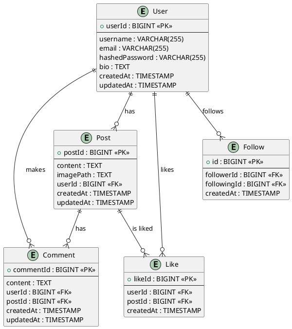

# Quackstagram Project Documentation

## Running the Application

### Prerequisites

### Database Setup

- **Database Creation**:

  - Creates the `quackstagram` database.
  - Creates the `quack_user` user with the specified password.
  - Grants all privileges on the `quackstagram` database to `quack_user`.

- **Schema Definition**:

  - Creates the `User`, `Post`, `Comment`, `Like`, and `Follow` tables with the specified columns and constraints.

- **Views**:

  - `UserActivity`: Aggregates user activity including post and comment counts.
  - `PopularPosts`: Lists posts sorted by the number of likes.
  - `SystemAnalytics`: Provides overall counts for users, posts, comments, likes, and follows.

- **Indexes**:

  - `idx_user_username`: Index on the `username` column of the `User` table.
  - `idx_post_content`: Index on the `content` column of the `Post` table (first 100 characters).

- **Procedures and Functions**:

  - `UpdatePostCount`: Procedure to update the post count for a user.
  - `GetUserPostCount`: Function to get the post count for a user.

- **Triggers**:
  - `after_insert_post`: Trigger that calls the `UpdatePostCount` procedure after a new post is inserted.
  - `before_insert_comment`: Trigger that sets the `createdAt` timestamp before a new comment is inserted.

### Running the Script

2. **Make the script executable:**
   ```sh
   chmod +x setup_mysql.sh
   ```
3. **Run the script:**
   ```sh
   ./setup_mysql.sh
   ```

This script will set up the MySQL database, user, schema, views, indexes, procedures, functions, and triggers.

## Java Models

### User Model

```java
public class User {
    private Long userId;
    private String username;
    private String email;
    private String hashedPassword;
    private String bio;
    private Timestamp createdAt;
    private Timestamp updatedAt;

    // Getters and Setters
}
```

### Post Model

```java
public class Post {
    private Long postId;
    private String content;
    private String imagePath;
    private Long userId;
    private Timestamp createdAt;
    private Timestamp updatedAt;

    // Getters and Setters
}
```

### Comment Model

```java
public class Comment {
    private Long commentId;
    private String content;
    private Long userId;
    private Long postId;
    private Timestamp createdAt;
    private Timestamp updatedAt;

    // Getters and Setters
}
```

### Like Model

```java
public class Like {
    private Long likeId;
    private Long userId;
    private Long postId;
    private Timestamp createdAt;

    // Getters and Setters
}
```

### Follow Model

```java
public class Follow {
    private Long id;
    private Long followerId;
    private Long followingId;
    private Timestamp createdAt;

    // Getters and Setters
}
```

## MySQL Schema

```sql
-- Create User table
CREATE TABLE IF NOT EXISTS User (
    userId BIGINT AUTO_INCREMENT PRIMARY KEY,
    username VARCHAR(255) NOT NULL UNIQUE,
    email VARCHAR(255) NOT NULL UNIQUE,
    hashedPassword VARCHAR(255) NOT NULL,
    bio TEXT,
    createdAt TIMESTAMP DEFAULT CURRENT_TIMESTAMP,
    updatedAt TIMESTAMP DEFAULT CURRENT_TIMESTAMP ON UPDATE CURRENT_TIMESTAMP
);

-- Create Post table
CREATE TABLE IF NOT EXISTS Post (
    postId BIGINT AUTO_INCREMENT PRIMARY KEY,
    content TEXT NOT NULL,
    imagePath TEXT NOT NULL,
    userId BIGINT NOT NULL,
    createdAt TIMESTAMP DEFAULT CURRENT_TIMESTAMP,
    updatedAt TIMESTAMP DEFAULT CURRENT_TIMESTAMP ON UPDATE CURRENT_TIMESTAMP,
    FOREIGN KEY (userId) REFERENCES User(userId)
);

-- Create Comment table
CREATE TABLE IF NOT EXISTS Comment (
    commentId BIGINT AUTO_INCREMENT PRIMARY KEY,
    content TEXT NOT NULL,
    userId BIGINT NOT NULL,
    postId BIGINT NOT NULL,
    createdAt TIMESTAMP DEFAULT CURRENT_TIMESTAMP,
    updatedAt TIMESTAMP DEFAULT CURRENT_TIMESTAMP ON UPDATE CURRENT_TIMESTAMP,
    FOREIGN KEY (userId) REFERENCES User(userId),
    FOREIGN KEY (postId) REFERENCES Post(postId)
);

-- Create Like table
CREATE TABLE IF NOT EXISTS `Like` (
    likeId BIGINT AUTO_INCREMENT PRIMARY KEY,
    userId BIGINT NOT NULL,
    postId BIGINT NOT NULL,
    createdAt TIMESTAMP DEFAULT CURRENT_TIMESTAMP,
    FOREIGN KEY (userId) REFERENCES User(userId),
    FOREIGN KEY (postId) REFERENCES Post(postId)
);

-- Create Follow table
CREATE TABLE IF NOT EXISTS Follow (
    id BIGINT AUTO_INCREMENT PRIMARY KEY,
    followerId BIGINT NOT NULL,
    followingId BIGINT NOT NULL,
    createdAt TIMESTAMP DEFAULT CURRENT_TIMESTAMP,
    FOREIGN KEY (followerId) REFERENCES User(userId),
    FOREIGN KEY (followingId) REFERENCES User(userId)
);

-- Create Views
CREATE VIEW UserActivity AS
SELECT User.username, COUNT(Post.postId) AS postCount, COUNT(Comment.commentId) AS commentCount
FROM User
LEFT JOIN Post ON User.userId = Post.userId
LEFT JOIN Comment ON User.userId = Comment.userId
GROUP BY User.username;

CREATE VIEW PopularPosts AS
SELECT Post.postId, Post.content, COUNT(`Like`.likeId) AS likeCount
FROM Post
LEFT JOIN `Like` ON Post.postId = `Like`.postId
GROUP BY Post.postId
ORDER BY likeCount DESC;

CREATE VIEW SystemAnalytics AS
SELECT COUNT(User.userId) AS userCount, COUNT(Post.postId) AS postCount, COUNT(Comment.commentId) AS commentCount, COUNT(`Like`.likeId) AS likeCount, COUNT(Follow.id) AS followCount
FROM User, Post, Comment, `Like`, Follow;

-- Create Indexes
CREATE INDEX idx_user_username ON User(username);
CREATE INDEX idx_post_content ON Post(content(100));

-- Develop Procedures, Functions, and Triggers
DELIMITER //

CREATE PROCEDURE UpdatePostCount(IN userId BIGINT)
BEGIN
    UPDATE User
    SET postCount = (SELECT COUNT(*) FROM Post WHERE Post.userId = User.userId)
    WHERE User.userId = userId;
END //

CREATE FUNCTION GetUserPostCount(userId BIGINT) RETURNS INT
BEGIN
    DECLARE postCount INT;
    SELECT COUNT(*) INTO postCount FROM Post WHERE Post.userId = userId;
    RETURN postCount;
END //

CREATE TRIGGER after_insert_post
AFTER INSERT ON Post
FOR EACH ROW
BEGIN
    CALL UpdatePostCount(NEW.userId);
END //

CREATE TRIGGER before_insert_comment
BEFORE INSERT ON Comment
FOR EACH ROW
BEGIN
    SET NEW.createdAt = CURRENT_TIMESTAMP;
END //

DELIMITER ;

```

## Database Connection

### DatabaseConnection Class

```java
import java.sql.Connection;
import java.sql.DriverManager;
import java.sql.SQLException;

public class DatabaseConnection {
    private static final String URL = "jdbc:mysql://localhost:3306/quackstagram";
    private static final String USER = "root";
    private static final String PASSWORD = "password";

    public static Connection getConnection() throws SQLException {
        return DriverManager.getConnection(URL, USER, PASSWORD);
    }
}
```

## Data Access Object (DAO)

### UserDAO Class

```java
import java.sql.*;
import java.util.ArrayList;
import java.util.List;

public class UserDAO {
    private Connection connection;

    public UserDAO() throws SQLException {
        this.connection = DatabaseConnection.getConnection();
    }

    public void createUser(User user) throws SQLException {
        String sql = "INSERT INTO User (username, email, hashedPassword, bio, createdAt, updatedAt) VALUES (?, ?, ?, ?, ?, ?)";
        try (PreparedStatement statement = connection.prepareStatement(sql, Statement.RETURN_GENERATED_KEYS)) {
            statement.setString(1, user.getUsername());
            statement.setString(2, user.getEmail());
            statement.setString(3, user.getHashedPassword());
            statement.setString(4, user.getBio());
            statement.setTimestamp(5, new Timestamp(System.currentTimeMillis()));
            statement.setTimestamp(6, new Timestamp(System.currentTimeMillis()));
            statement.executeUpdate();
            try (ResultSet generatedKeys = statement.getGeneratedKeys()) {
                if (generatedKeys.next()) {
                    user.setUserId(generatedKeys.getLong(1));
                }
            }
        }
    }

    public User findUser(Long userId) throws SQLException {
        String sql = "SELECT * FROM User WHERE userId = ?";
        try (PreparedStatement statement = connection.prepareStatement(sql)) {
            statement.setLong(1, userId);
            try (ResultSet resultSet = statement.executeQuery()) {
                if (resultSet.next()) {
                    User user = new User();
                    user.setUserId(resultSet.getLong("userId"));
                    user.setUsername(resultSet.getString("username"));
                    user.setEmail(resultSet.getString("email"));
                    user.setHashedPassword(resultSet.getString("hashedPassword"));
                    user.setBio(resultSet.getString("bio"));
                    user.setCreatedAt(resultSet.getTimestamp("createdAt"));
                    user.setUpdatedAt(resultSet.getTimestamp("updatedAt"));
                    return user;
                }
            }
        }
        return null;
    }

    public void updateUser(User user) throws SQLException {
        String sql = "UPDATE User SET username = ?, email = ?, hashedPassword = ?, bio = ?, updatedAt = ? WHERE userId = ?";
        try (PreparedStatement statement = connection.prepareStatement(sql)) {
            statement.setString(1, user.getUsername());
            statement.setString(2, user.getEmail());
            statement.setString(3, user.getHashedPassword());
            statement.setString(4, user.getBio());
            statement.setTimestamp(5, new Timestamp(System.currentTimeMillis()));
            statement.setLong(6, user.getUserId());
            statement.executeUpdate();
        }
    }

    public void deleteUser(Long userId) throws SQLException {
        String sql = "DELETE FROM User WHERE userId = ?";
        try (PreparedStatement statement = connection.prepareStatement(sql)) {
            statement.setLong(1, userId);
            statement.executeUpdate();
        }
    }

    public List<User> findAllUsers() throws SQLException {
        List<User> users = new ArrayList<>();
        String sql = "SELECT * FROM User";
        try (Statement statement = connection.createStatement();
             ResultSet resultSet = statement.executeQuery(sql)) {
            while (resultSet.next()) {
                User user = new User();
                user.setUserId(resultSet.getLong("userId"));
                user.setUsername(resultSet.getString("username"));
                user.setEmail(resultSet.getString("email"));
                user.setHashedPassword(resultSet.getString("hashedPassword"));
                user.setBio(resultSet.getString("bio"));
                user.setCreatedAt(resultSet.getTimestamp("createdAt"));
                user.setUpdatedAt(resultSet.getTimestamp("updatedAt"));
                users.add(user);
            }
        }
        return users;
    }

    // Similar CRUD methods for Post, Comment, Like, Follow
    // ...
}
```

### Example Usage

```java
public class Main {
    public static void main(String[] args) {
        try {
            UserDAO userDAO = new UserDAO();

            // Create a new user
            User user = new User();
            user.setUsername("john_doe");
            user.setEmail("john@example.com");
            user.setHashedPassword("hashed_password");
            user.setBio("Just a regular user.");

            userDAO.createUser(user);

            // Find the user by ID
            User foundUser = userDAO.findUser(user.getUserId());
            System.out.println("Found user: " + foundUser.getUsername());

            // Update the user
            foundUser.setBio("Updated bio.");
            userDAO.updateUser(foundUser);

            // Delete the user
            userDAO.deleteUser(foundUser.getUserId());
        } catch (SQLException e) {
            e.printStackTrace();
        }
    }
}
```

## Proof of 3NF

### User Table

1. **First Normal Form (1NF):** The table is in 1NF since all values are atomic and there are no repeating groups.
2. **Second Normal Form (2NF):** The table is in 2NF since there are no partial dependencies (all non-key attributes are fully dependent on the primary key).
3. **Third Normal Form (3NF):** The table is in 3NF since there are no transitive dependencies (all non-key attributes are directly dependent on the primary key).

### Post Table

1. **First Normal Form (1NF):** The table is in 1NF since all values are atomic and there are no repeating groups.
2. **Second Normal Form (2NF):** The table is in 2NF since there are no partial dependencies (all non-key attributes are fully dependent on the primary key).
3. **Third Normal Form (3NF):** The table is in 3NF since there are no transitive dependencies (all non-key attributes are directly dependent on the primary key).

### Comment Table

1. **First Normal Form (1NF):** The table is in 1NF since all values are atomic and there are

no repeating groups. 2. **Second Normal Form (2NF):** The table is in 2NF since there are no partial dependencies (all non-key attributes are fully dependent on the primary key). 3. **Third Normal Form (3NF):** The table is in 3NF since there are no transitive dependencies (all non-key attributes are directly dependent on the primary key).

### Like Table

1. **First Normal Form (1NF):** The table is in 1NF since all values are atomic and there are no repeating groups.
2. **Second Normal Form (2NF):** The table is in 2NF since there are no partial dependencies (all non-key attributes are fully dependent on the primary key).
3. **Third Normal Form (3NF):** The table is in 3NF since there are no transitive dependencies (all non-key attributes are directly dependent on the primary key).

### Follow Table

1. **First Normal Form (1NF):** The table is in 1NF since all values are atomic and there are no repeating groups.
2. **Second Normal Form (2NF):** The table is in 2NF since there are no partial dependencies (all non-key attributes are fully dependent on the primary key).
3. **Third Normal Form (3NF):** The table is in 3NF since there are no transitive dependencies (all non-key attributes are directly dependent on the primary key).

All tables (User, Post, Comment, Like, Follow) are in 3NF because:

- Each table is already in 1NF (all attributes are atomic).
- Each table is in 2NF (all non-key attributes are fully functionally dependent on the whole primary key).
- Each table is in 3NF (there are no transitive dependencies, i.e., non-key attributes are not dependent on other non-key attributes).

## ERD Diagram

### Rendered EDR


### PlantUML Code


